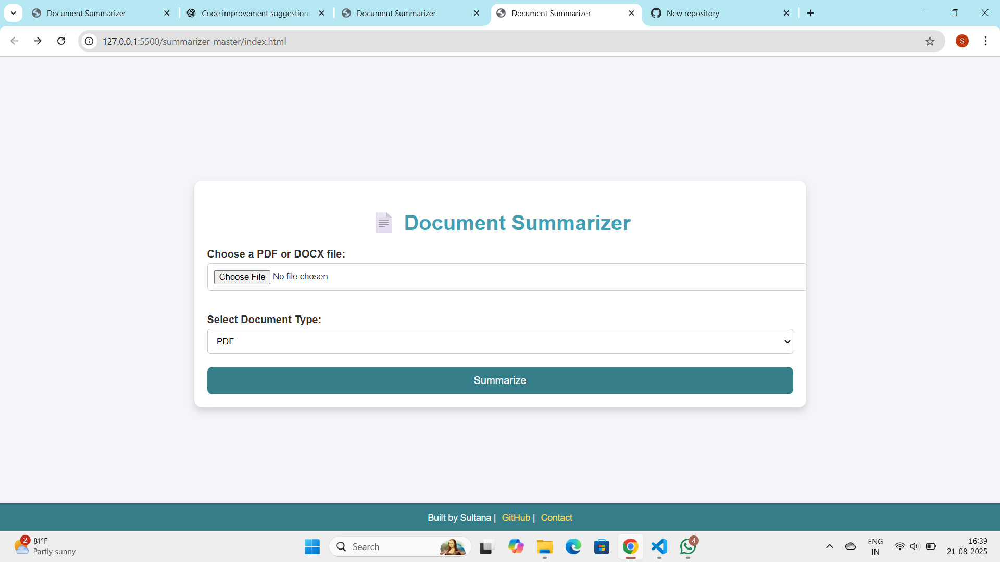

📄 Document AI Summarizer

A simple web-based tool to **upload PDF or DOCX files** and generate a **quick summary** of their content.  
Built using **JavaScript, pdf.js, and mammoth.js**.


🚀 Features
- Upload **PDF** or **DOCX** files.
- Extracts text using:
  - [`pdf.js`](https://mozilla.github.io/pdf.js/) for PDFs.
  - [`mammoth.js`](https://github.com/mwilliamson/mammoth.js) for DOCX.
- Simple **summarization**
- Clean and responsive **UI**
- Styled footer with credits.


 🛠️ Tech Stack
- HTML5
- CSS3 
- JavaScript 
- pdf.js
- mammoth.js


📂 Project Structure

.
├── index.html   # Main application file
├── README.md    # Documentation


⚙️ How to Run
1. Clone or download this repository:
   ```bash
   git clone https://github.com/sadiyasultana/AI-Summarizer.git

2. Open`index.html in your **web browser** .


## 📸 Screenshot



👩‍💻 Author

Built with ❤️ by **Sultana**


